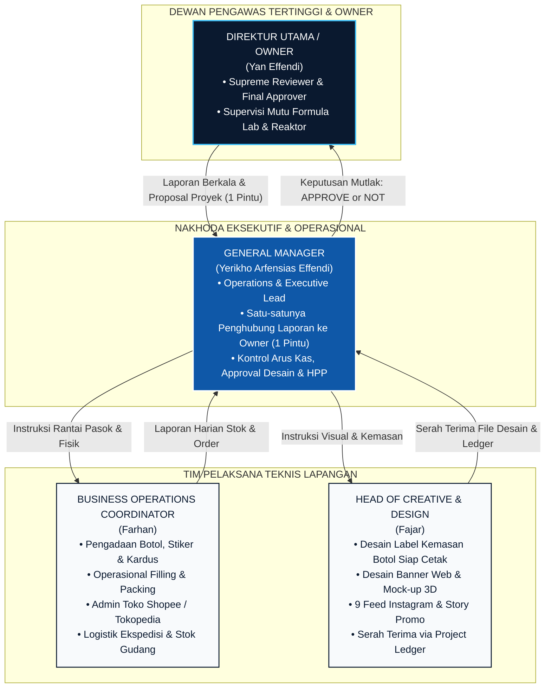
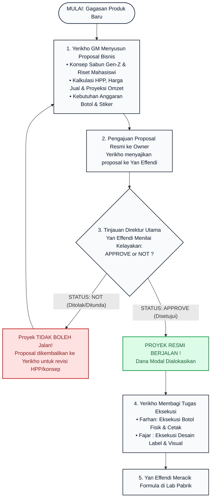
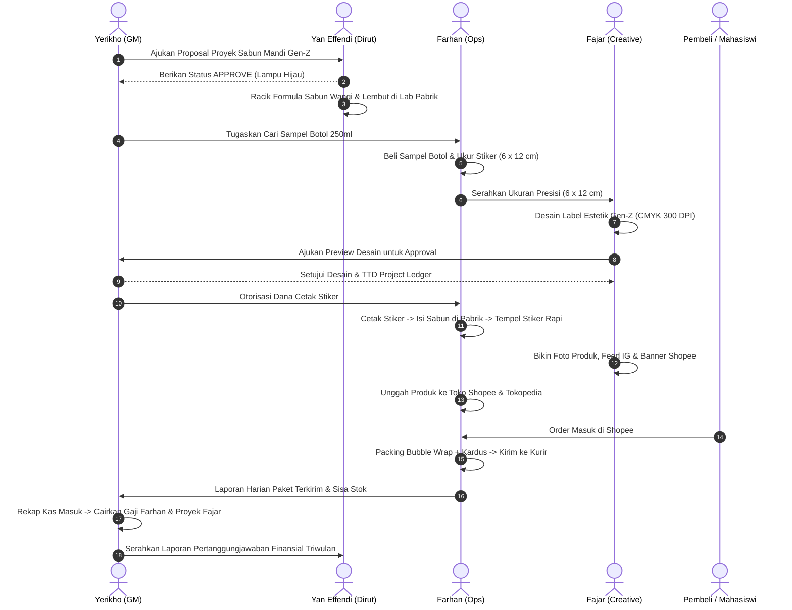
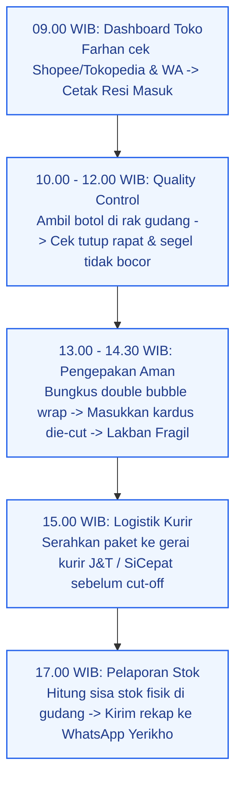

# 📚 BUKU PELAJARAN & MANUAL UTAMA OPERASIONAL TIM
## PANDUAN LENGKAP STRUKTUR TATA KELOLA, URAIAN JABATAN, RUANG LINGKUP KERJA,
## DAN FLOWCHART ALUR EKSEKUSI BISNIS PT KEDIRI CHEMICAL ABADI 2026

```
DOKUMEN PANDUAN POKOK OPERASIONAL — STANDAR MUTU ISO 9001:2015
Nomor Dokumen   : TEX-01/MGT-KCA/2026
Tanggal Berlaku : 6 September 2026
Penyusun        : Yerikho Arfensias Effendi (General Manager)
Disetujui Oleh  : Yan Effendi (Direktur Utama / Owner)
Pihak Terkait   : Farhan (Business Operations Coordinator) & Fajar (Head of Creative & Design)
Klasifikasi     : Buku Pegangan Wajib (Wajib Dipelajari, Dipahami, dan Dijalankan)
```

---

## 📑 DAFTAR ISI BUKU PELAJARAN:

* **MODUL 1: FONDASI, FILOSOFI & ARSITEKTUR HIERARKI PERUSAHAAN**
  * *1.1 Teori Tata Kelola "Two-Tier Governance & Single Reporting Bridge"*
  * *1.2 Visualisasi Diagram Pohon Hierarki Resmi*
  * *1.3 Dua Hukum Baku Komunikasi Organisasi*
* **MODUL 2: BUKU INDUK URAIAN JABATAN (JOB DESCRIPTIONS) & RUANG LINGKUP**
  * *2.1 Direktur Utama / Owner (Yan Effendi) — Supreme Reviewer & Final Approver*
  * *2.2 General Manager (Yerikho Arfensias Effendi) — Operations & Executive Lead*
  * *2.3 Business Operations Coordinator (Farhan) — Supply Chain & Field Engine*
  * *2.4 Head of Creative & Design (Fajar) — Brand & Visual Lead*
* **MODUL 3: FLOWCHART VISUAL STANDAR OPERASIONAL PROSEDUR (SOP)**
  * *3.1 Flowchart Gerbang Keputusan Proyek (Supreme Approval Gate)*
  * *3.2 Flowchart Peluncuran Produk Baru Lini Body Care (End-to-End)*
  * *3.3 Flowchart Pemenuhan Pesanan Harian Marketplace (Order-to-Dispatch)*
* **MODUL 4: STUDI KASUS OPERASIONAL & PANDUAN PEMECAHAN MASALAH**
  * *Kasus 1: Botol Kemasan Bocor Saat Pengiriman*
  * *Kasus 2: Hasil Cetak Stiker Salah Ukuran atau Miring*
  * *Kasus 3: Pesanan Toko Melonjak Drastis Saat Promo*
* **MODUL 5: MATRIKS WEWENANG (AUTHORITY MATRIX) & LEMBAR PENGESAHAN**

---

# MODUL 1: FONDASI, FILOSOFI & ARSITEKTUR HIERARKI PERUSAHAAN

### 1.1 Teori Tata Kelola "Two-Tier Governance & Single Reporting Bridge"
Dalam manajemen perusahaan industri manufaktur modern, keberhasilan eksekusi bergantung pada **kejelasan rantai komando (*chain of command*)**. Banyak bisnis startup gagal bukan karena produknya jelek, melainkan karena:
1. Pimpinan tertinggi (*Owner*) terbebani oleh urusan-urusan teknis kecil yang menghabiskan energinya.
2. Staf teknis bingung harus mendengarkan siapa karena menerima instruksi dari banyak pimpinan sekaligus (*multiple bosses*).
3. Tidak ada gerbang evaluasi (*gatekeeping*) yang jelas sebelum uang modal digelontorkan.

Untuk mencegah masalah tersebut, **PT Kediri Chemical Abadi** mengunci sistem tata kelola **Two-Tier Governance & Single Reporting Bridge**:
* **Tingkat 1 (Direksi Pengawas / Owner)**: Menilai kelayakan strategis dari helikopter, mengawasi kualitas mutu lab kimia, dan memberikan keputusan mutlak: **APPROVE or NOT**.
* **Tingkat 2 (Nakhoda Eksekutif / GM)**: Merancang proposal bisnis, menyajikan laporan komprehensif kepada Owner, membagi tugas kepada tim teknis, dan mengontrol arus kas harian.
* **Tingkat Pelaksana Lapangan (Ops & Design)**: Fokus 100% pada eksekusi tugas spesifik di bawah komando satu pintu General Manager.

---

### 1.2 Visualisasi Diagram Pohon Hierarki & Alur Pelaporan Resmi



---

### 1.3 Dua Hukum Baku Komunikasi Organisasi
* **HUKUM 1 (Single Reporting Line)**: Farhan dan Fajar **TIDAK MELAPOR LANGSUNG** kepada Direktur Utama. Seluruh pelaporan, pengajuan kendala, dan serah terima file bermuara kepada General Manager (Yerikho).
* **HUKUM 2 (Owner Protection)**: Direktur Utama / Owner dilindungi dari kerumitan teknis (tidak meladeni chat pembeli, packing kardus, atau revisi stiker). Beliau hanya berhadapan dengan General Manager.

---

# MODUL 2: BUKU INDUK URAIAN JABATAN (JOB DESCRIPTIONS) & RUANG LINGKUP

---

### 2.1 DIREKTUR UTAMA / OWNER — YAN EFFENDI
* **Kedudukan**: Pengawas Tertinggi & Pemegang Keputusan Mutlak (*Supreme Reviewer & Final Approver*).
* **Maksud Jabatan**: Memastikan setiap proyek yang dijalankan perusahaan layak secara bisnis dan aman secara teknis kimia, serta menjaga integritas formula produk pabrik.
* **Ruang Lingkup Tanggung Jawab**:
  1. **Executive Review**: Memeriksa proposal proyek yang diajukan oleh General Manager.
  2. **Otorisasi Keputusan Mutlak**: Menetapkan status **APPROVE** (proyek boleh jalan) atau **NOT** (proyek ditolak/ditunda).
  3. **R&D Kimia Laboratorium**: Meracik formula sabun cair, shampoo, dan body care di lab pabrik Mojoroto (memastikan busa berlimpah, wangi harum tahan lama, dan pH aman 5.5 - 6.5).
  4. **Supervisi Reaktor Stainless 316L**: Memantau operasional tangki reaktor saat proses pengadukan batch massal.
  5. **Audit Keuangan Triwulan**: Menerima laporan laba rugi berkala sebagai dasar pembagian dividen modal.
* **Batas Wewenang**:
  - *Wewenang*: Memiliki hak veto mutlak menghentikan proyek dan menentukan standar mutu kimia.
  - *Larangan*: Tidak mengurusi administrasi marketplace, teknis packing paket, atau media sosial.

---

### 2.2 GENERAL MANAGER — YERIKHO ARFENSIAS EFFENDI
* **Kedudukan**: Pemimpin Tertinggi Operasional Harian & Satu-Satunya Jembatan ke Owner (*Operations & Executive Lead*).
* **Maksud Jabatan**: Menggerakkan roda bisnis perusahaan, mengendalikan arus kas, dan memimpin eksekusi tim Farhan dan Fajar dari hulu ke hilir.
* **Ruang Lingkup Tanggung Jawab**:
  1. **Inisiasi & Pengajuan Proposal Proyek**: Menyusun rencana bisnis lini produk baru (riset pasar mahasiswi/Gen-Z, kalkulasi HPP, harga jual pasar, modal kemasan, dan proyeksi omzet) lalu menyajikannya ke Direktur Utama untuk mendapatkan status APPROVE.
  2. **Komando Operasional Pasca-Approval**: Setelah status APPROVED, membagi tugas teknis kepada Farhan (operasional) dan Fajar (kreatif).
  3. **Manajemen Keuangan (*Cash Flow*)**: Mengontrol pengeluaran kas belanja harian dan mengalokasikan pencairan gaji Farhan serta hak proyek Fajar.
  4. **Persetujuan Mutu Visual (ACC Cetak)**: Memeriksa dan menandatangani persetujuan desain label kemasan dari Fajar sebelum dibawa Farhan ke percetakan.
  5. **Kemitraan Komersial B2B**: Memimpin negosiasi maklon skala besar, pasokan hotel, dan jaringan reseller kampus.
* **Batas Wewenang**:
  - *Wewenang*: Otoritas penuh pengeluaran kas, penetapan harga jual, persetujuan cetak desain, dan penugasan tim.
  - *Kewajiban*: Wajib mendapatkan status APPROVE dari Direktur Utama sebelum mencairkan modal untuk proyek baru.

---

### 2.3 BUSINESS OPERATIONS COORDINATOR — FARHAN
* **Kedudukan**: Bertanggung jawab langsung 100% kepada General Manager (Yerikho).
* **Maksud Jabatan**: Tangan kanan GM yang mengendalikan seluruh rantai pasok fisik: pengadaan botol, stiker, operasional pengisian sabun, administrasi toko marketplace, hingga pengiriman paket ke kurir.
* **Ruang Lingkup 5 Divisi Fisik**:

```
┌────────────────────────────────────────────────────────────────────────┐
│                   5 DIVISI KERJA HARIAN FARHAN                         │
├────────────────────┬────────────────────┬──────────────────────────────┤
│ 1. PENGADAAN (PRO) │ 2. PABRIK & FILLING│ 3. ADMIN MARKETPLACE         │
│ • Beli sampel botol│ • Isi sabun cair   │ • Kelola toko Shopee/Tokped  │
│ • Ukur stiker (mm) │ • Pasang stiker    │ • Upload foto produk         │
│ • Order stiker vinyl│ • Cek QC botol rembes│ • Balas chat ramah & cepat │
├────────────────────┴────────────────────┴──────────────────────────────┤
│ 4. LOGISTIK & PACKING (FULFILLMENT)     │ 5. STOK & PELAPORAN          │
│ • Bungkus double bubble wrap tebal      │ • Rekap sisa stok di gudang  │
│ • Masukkan kardus die-cut & lakban      │ • Lapor jumlah paket kirim   │
│ • Serahkan ke kurir J&T/SiCepat sore    │ • Laporan harian ke WA GM    │
└─────────────────────────────────────────┴──────────────────────────────┘
```

* **Jadwal Rutinitas Kerja Harian Farhan**:
  - `08.30 - 09.30`: Buka Shopee/Tokopedia, cetak seluruh label resi pesanan masuk.
  - `09.30 - 12.00`: Ambil botol di rak gudang, periksa segel tutup rapat, bungkus bubble wrap & kardus.
  - `12.00 - 13.00`: Istirahat siang.
  - `13.00 - 15.00`: Hubungi vendor botol/stiker, isi botol sabun di pabrik, atau pasang stiker baru.
  - `15.00 - 16.30`: Bawa paket pesanan ke gerai kurir ekspedisi (J&T/SiCepat).
  - `16.30 - 17.00`: Hitung sisa stok dan kirim rekap laporan harian ke WhatsApp Yerikho.
* **Batas Wewenang & Larangan**:
  - *Dilarang*: Mengubah harga jual atau memberi diskon tanpa izin GM.
  - *Dilarang*: Membelanjakan uang tanpa pengajuan anggaran yang disetujui GM.
  - *Dilarang*: Mengirim pesanan tanpa bubble wrap tebal.

---

### 2.4 HEAD OF CREATIVE & DESIGN — FAJAR
* **Kedudukan**: Bertanggung jawab langsung 100% kepada General Manager (Yerikho).
* **Maksud Jabatan**: Pemimpin identitas visual yang mengubah cairan sabun pabrik menjadi produk yang bernilai estetika tinggi, terlihat mewah, wangi, dan membuat anak muda/wanita langsung terdorong membeli.
* **Ruang Lingkup 5 Pilar Desain**:
  1. **Desain Kemasan Siap Cetak (*Packaging Design*)**:
     - Merancang label botol sabun mandi, shampoo, dan body care bergaya modern Gen-Z.
     - Menggunakan ukuran presisi dari Farhan (misal: $6 \times 12\text{ cm}$).
     - Wajib memuat elemen resmi: Nama Brand, Varian Wangi, Keunggulan Non-Fosfat, Netto ml, Komposisi, Cara Pakai, Logo KCA, dan Info Pabrik Kediri.
  2. **Standar Percetakan Profesional (*Print-Ready Specs*)**:
     - Format: PDF Vektor / Adobe Illustrator (.AI).
     - Color Space: **CMYK murni** (Dilarang RGB agar warna tidak redup saat dicetak).
     - Resolusi: **300 DPI** (agar tulisan komposisi tajam dan tidak pecah).
     - Bleed: Diberi lebihan potong 2 mm keliling + garis potong (*Crop Marks*).
  3. **Aset Visual Website Resmi**:
     - Mendesain banner Hero produk baru untuk kca.co.id.
     - Membuat mock-up visual botol kemasan 3D yang bersih untuk katalog.
  4. **Konten Media Sosial (Instagram & Facebook)**:
     - Merancang paket 9 feed Instagram estetik perdana peluncuran lini baru.
     - Membuat template Story harian (testimoni, manfaat formula, promo diskon).
     - Mendesain banner cover toko Shopee/Tokopedia berukuran 1080x1080 px.
  5. **Buku Catatan Proyek (*Project Ledger*)**:
     - Menyerahkan master file akhir ke General Manager dan mencatatnya ke Formulir Project Ledger untuk pencairan kompensasi proyek.
* **Batas Wewenang & Larangan**:
  - *Dilarang*: Mengirim file ke percetakan komersial sebelum di-ACC tertulis oleh GM.
  - *Dilarang*: Mengubah ukuran label tanpa koordinasi fisik dengan Farhan.
  - *Dilarang*: Mempublikasikan materi promosi di media sosial tanpa preview GM.

---

# MODUL 3: FLOWCHART VISUAL STANDAR OPERASIONAL PROSEDUR (SOP)

### 3.1 FLOWCHART GERBANG KEPUTUSAN PROYEK (SUPREME APPROVAL GATE)



---

### 3.2 FLOWCHART PELUNCURAN PRODUK BARU DARI HULU KE HILIR (END-TO-END)



---

### 3.3 FLOWCHART ALUR PEMENUHAN PESANAN HARIAN (ORDER FULFILLMENT)



---

# MODUL 4: STUDI KASUS OPERASIONAL & PANDUAN PEMECAHAN MASALAH

Buku panduan ini membekali tim dengan panduan tindakan cepat ketika menghadapi kendala nyata di lapangan:

### Kasus 1: Botol Kemasan Bocor Saat Diterima Pembeli di Luar Kota
* **Penyebab**: Tutup botol kurang kencang atau tekanan ekspedisi menekan botol yang bubble wrap-nya tipis.
* **Prosedur Pemecahan (Farhan)**:
  1. *Respon Cepat*: Balas chat pembeli dengan sopan dalam waktu $< 15$ menit: *"Mohon maaf atas ketidaknyamanannya Kak. KCA bertanggung jawab penuh atas pesanan Kakak."*
  2. *Bukti Valid*: Minta pembeli mengirimkan video/foto unboxing.
  3. *Lapor GM*: Hubungi Yerikho untuk otorisasi kirim barang pengganti (retur gratis 100%).
  4. *Tindakan Pencegahan*: Semua botol berikutnya wajib diberi segel solasi bening di leher ulir tutup sebelum dibungkus bubble wrap.

### Kasus 2: Hasil Cetak Stiker Salah Ukuran atau Miring
* **Penyebab**: Kesalahan pengukuran manual atau tidak adanya garis batas potong (*bleed*).
* **Prosedur Pemecahan (Farhan & Fajar)**:
  1. Jangan pasang stiker yang cacat ke botol jualan!
  2. Farhan membawa botol fisik langsung ke tempat Fajar.
  3. Fajar mengukur ulang lingkar botol fisik dan mencocokkan artboard master.
  4. Cetak sampel 1 lembar terlebih dahulu untuk ditempel ke botol sebagai uji kecocokan sebelum mencetak ratusan lembar.

### Kasus 3: Pesanan Toko Melonjak Drastis 5x Lipat Saat Event Promo
* **Penyebab**: Materi promosi dan feed Instagram Fajar berhasil menarik minat pasar secara masif.
* **Prosedur Pemecahan (Seluruh Tim)**:
  1. Farhan segera menghitung sisa stok fisik botol kosong dan cairan sabun, lalu lapor ke Yerikho.
  2. Yerikho meminta Pak Yan untuk menambah jadwal pengadukan sabun di tangki reaktor pabrik.
  3. Farhan fokus penuh pada proses packing kardus dengan sistem *assembly line* (stiker dulu $\rightarrow$ isi sabun $\rightarrow$ bungkus bubble wrap).

---

# MODUL 5: MATRIKS WEWENANG (AUTHORITY MATRIX) & LEMBAR PENGESAHAN

### Matriks Otorisasi Keputusan:
| Jenis Keputusan Bisnis | Pelaksana | Reviewer & Approver | Dampak Jika "NOT" (Ditolak) |
| :--- | :---: | :---: | :---: |
| **Peluncuran Proyek Baru & Modal** | Yerikho (GM) | **Yan Effendi (Dirut)** | Proyek tidak boleh dijalankan |
| **Perubahan Formulasi Kimia Sabun** | Yan Effendi (Dirut) | **Yan Effendi (Dirut)** | Mempertahankan formula baku |
| **Persetujuan Desain Label Naik Cetak** | Fajar (Creative) | **Yerikho (GM)** | Desain wajib direvisi Fajar |
| **Otorisasi Belanja Botol, Stiker & Kardus** | Farhan (Ops) | **Yerikho (GM)** | Dana kas belanja tidak cair |
| **Penetapan Harga Jual & Promo Diskon** | Yerikho (GM) | **Yerikho (GM)** | Menggunakan harga standar |
| **Pencairan Hak Gaji & Project Ledger** | Yerikho (GM) | **Yerikho & Yan Effendi** | Menunggu kesiapan arus kas |

---

### LEMBAR PENGESAHAN BUKU PANDUAN UTAMA

Buku Pelajaran & Manual Operasional ini disahkan secara resmi dan mengikat seluruh jajaran manajemen PT Kediri Chemical Abadi sejak tanggal 6 September 2026.

```
Ditetapkan di : Kota Kediri
Pada Tanggal  : 6 September 2026

Disetujui Oleh,                                   Ditetapkan Oleh,
Direktur Utama / Owner                            General Manager
(Supreme Reviewer & Approver)                     (Operations & Executive Lead)


 [ YAN EFFENDI ]                              [ YERIKHO ARFENSIAS EFFENDI ]


Pihak Yang Melaksanakan,                          Pihak Yang Melaksanakan,
Business Operations Coordinator                   Head of Creative & Design


    [ FARHAN ]                                          [ FAJAR ]
```

---

*Dokumen Buku Panduan Pokok PT Kediri Chemical Abadi. Dilarang menggandakan tanpa izin tertulis manajemen.*
